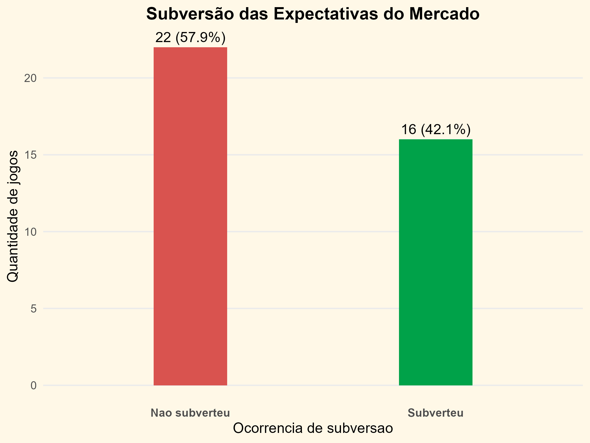
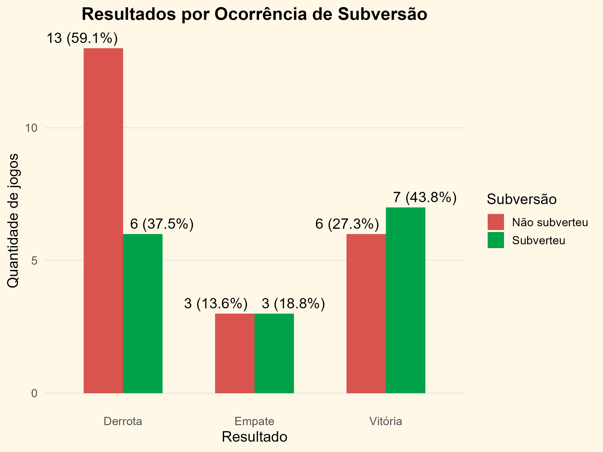
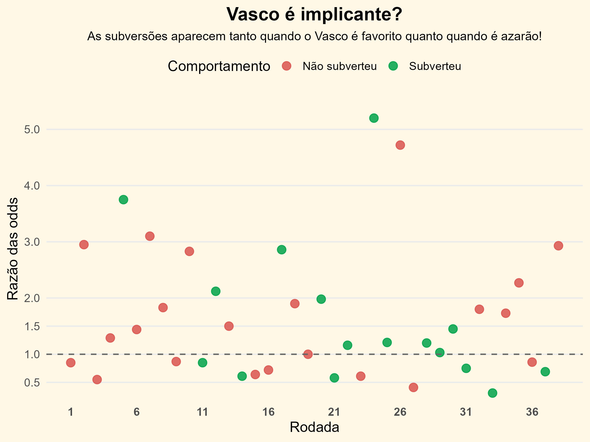

# Subversao_vasco
  Análise das expectativas pré-jogo e dos resultados do Vasco no Brasileirão 2025 usando R.

## Objetivo

  Neste projeto, analisei uma percepção comum entre nós torcedores do Vasco da Gama: a ideia de que o time costuma contrariar as expectativas pré-jogo, vencendo quando é considerado azarão, tropeçando quando é apontado como favorito e até mesmo empatando quando havia uma expectativa clara de vitória ou derrota.

  Para avaliar essa percepção de forma objetiva, analisei as odds pré-jogo e os resultados dos 38 jogos do Vasco no Campeonato Brasileiro de 2025.

## Dados

  As informações foram coletadas no SofaScore e incluem as odds pré-jogo para vitória, derrota e empate, além do resultado das partidas e outras informações sobre os jogos.

  O conjunto de dados está armazenado no arquivo oddVasco.csv, dentro da pasta data/.

As variáveis presentes no conjunto de dados são:

- `rodada`: rodada do Campeonato Brasileiro.
- `mandante`: indica se o Vasco foi mandante (`S`) ou visitante (`N`).
- `oddVitoria`: odd pré-jogo para vitória do Vasco.
- `oddDerrota`: odd pré-jogo para derrota do Vasco.
- `oddEmpate`: odd pré-jogo para empate.
- `vermelho`: indica a ocorrência de expulsão na partida.
- `resultado`: resultado do Vasco, sendo `V` (vitória), `E` (empate) ou `D` (derrota).

Nesta primeira análise, utilizei principalmente as odds pré-jogo e o resultado das partidas. As informações sobre mando de campo e expulsões foram mantidas no conjunto de dados para possibilitar análises futuras.

## Metodologia

Para comparar as expectativas do mercado com os resultados das partidas, criei a variável razao, calculada a partir da divisão entre a odd de vitória e a odd de derrota do Vasco:

razao = oddVitoria / oddDerrota
Os valores da razao foram arredondados para duas casas decimais.

A interpretação dessa razão é:

- `razao` < 1: o Vasco era considerado favorito, pois sua odd de vitória era menor que a odd de derrota.
- `razao` > 1: o Vasco era considerado azarão, pois sua odd de vitória era maior que a odd de derrota.
- `razao` = 1: as odds de vitória e derrota eram iguais, indicando expectativas equilibradas.

Após calcular a razao, criei a variável subversao, inicialmente definida como FALSE, e classifiquei como TRUE os resultados que contrariaram as expectativas indicadas pelas odds.

Foram consideradas subversões:

- **Vitória quando o Vasco era azarão**: `resultado = V` e `razao > 1`.
- **Derrota quando o Vasco era favorito**: `resultado = D` e `razao < 1`.
- **Empate com expectativa claramente desequilibrada**: `resultado = E` e `razao > 2` ou `razao < 0.5`.

Para os empates, utilizei um critério mais restritivo porque um empate pode ocorrer mesmo quando as expectativas de vitória e derrota são relativamente próximas. Assim, considerei subversão apenas quando uma das odds era mais que duas vezes maior que a outra.

As demais partidas foram classificadas como FALSE, indicando que o resultado não foi considerado uma subversão segundo esses critérios.

A preparação dos dados foi centralizada no arquivo preparacaoDados.R, que realiza a leitura do conjunto de dados e cria as variáveis utilizadas na análise.

Os scripts de análise e visualização utilizam essa função para obter os dados já preparados, evitando a repetição das mesmas etapas em diferentes arquivos.

As visualizações foram desenvolvidas com ggplot2, utilizando os dados preparados para representar a frequência de subversões, sua relação com os resultados das partidas e sua distribuição ao longo das 38 rodadas do campeonato.

## Resultados

Dos 38 jogos analisados, 16 foram classificados como subversões das expectativas pré-jogo, enquanto 22 não foram. Isso corresponde a:

- **16 subversões (42,1%)**
- **22 jogos sem subversão (57,9%)**

Ao analisar os resultados das partidas, das 13 vitórias do Vasco, mais da metade foram classificadas como subversões! Vencendo 7 vezes, correspondendo a **53,8% das vitórias**. Entre as 19 derrotas, 6 foram classificadas como subversões, correspondendo a **31,6% das derrotas**. Dos 6 empates, 3 foram classificados como subversões (**50% dos empates**).

As subversões ocorreram em quantidades consideráveis tanto quando o Vasco era visto como favorito quanto quando era visto como azarão e até mesmo nos resultados de empate onde havia clara expectativa de vitoria ou derrota, não se concentrando em apenas um dos lados das expectativas pré-jogo.

## Visualizações

As visualizações foram desenvolvidas em ggplot2 e têm como objetivo apresentar diferentes aspectos da relação entre as expectativas pré-jogo e os resultados do Vasco.

**Subversão das Expectativas do Mercado**

Mostra a quantidade e a proporção de partidas classificadas como subversões e não subversões.

**Resultados por Ocorrência de Subversão**

Mostra como as vitórias, empates e derrotas se distribuem entre partidas classificadas como subversões e não subversões.

**Vasco é implicante?**

Mostra a distribuição das partidas ao longo das 38 rodadas, relacionando a `razao` das odds com a ocorrência de subversões.

## Limitações

Esta análise possui algumas limitações. A principal é o número de partidas analisadas, restrito aos 38 jogos do Vasco no Campeonato Brasileiro de 2025. Dessa forma, os resultados representam o comportamento observado nessa temporada e não permitem generalizar a existência de uma tendência para outras temporadas.

Além disso, a classificação de subversão depende dos critérios definidos neste projeto, especialmente no caso dos empates, nos quais foi adotado um limite mais restritivo para considerar que havia uma expectativa clara de vitória ou derrota.

A `razao` também considera apenas as odds de vitória e derrota do Vasco. A odd de empate não é utilizada diretamente nesse cálculo, embora tenha sido coletada e esteja disponível no conjunto de dados.

Por fim, esta é uma análise descritiva e, portanto, os resultados não permitem afirmar que o Vasco tenha uma tendência estatisticamente comprovada de contrariar as expectativas do mercado. O objetivo é quantificar e visualizar o comportamento observado a partir dos dados disponíveis.

## Conclusão

Os resultados mostram que a percepção de que o Vasco costuma contrariar as expectativas pré-jogo não é apenas uma impressão isolada. Das 38 partidas analisadas, **16 foram classificadas como subversões, representando 42,1% dos jogos**.

Embora esse percentual seja inferior à metade, ainda representa uma quantidade considerável de resultados que contrariaram as expectativas do mercado. As subversões ocorreram tanto quando o Vasco era considerado favorito quanto quando era visto como azarão, além de também aparecerem em empates com expectativas claras de vitória ou derrota.

Os dados não permitem afirmar que o Vasco seja consistentemente contrário às expectativas, **mas os 42,1% de subversões tornam essa percepção uma hipótese interessante**, podendo indicar um comportamento particularmente imprevisível ou caótico da equipe.

Como evolução do projeto, pretendo automatizar a coleta dos dados para analisar outras temporadas e, futuramente, comparar o comportamento do Vasco com o de outros clubes.
